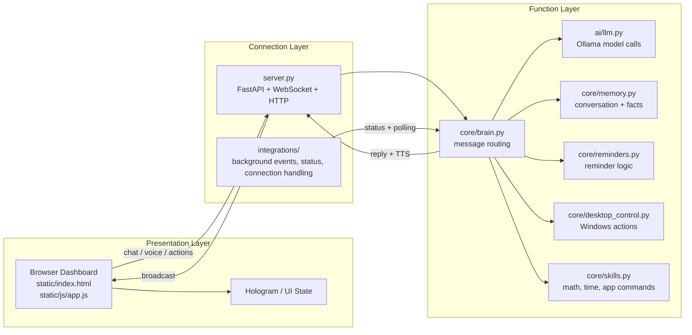

# Shadow AI

Shadow is a locally hosted Windows assistant that runs on your PC and is controlled from a browser on the same network. It combines voice input, wake-word trigger, local LLM responses via Ollama, reminders, browser TTS, and Windows desktop automation in one project.

## Overview

Shadow is designed to feel like a lightweight local personal assistant:

- It runs entirely on your own machine.
- It can be opened from any browser on your home network.
- It uses a local model through Ollama instead of a cloud-only AI backend.
- It can understand quick commands, open apps, manage reminders, search the web, and perform basic desktop actions.

This project is meant to be simple and self-hosted, with a clean split between UI, logic, and connection layers.

## Key Features

- Browser-based dashboard with voice input and wake-word activation
- Local LLM chat using Ollama
- Reminder parsing and background reminder checking
- Memory and fact extraction for recurring user context
- Windows desktop control for app/window/volume/power actions
- TTS response playback in the browser
- LAN accessibility from phone, tablet, or laptop
- Authenticated API token protection for trusted local use

## Architecture Diagram



## Layer Responsibilities

### 1. Presentation Layer
Location: `static/`

This layer is the browser interface. It handles:

- dashboard rendering
- microphone capture and speech recognition
- wake-word detection UI
- chat display and action controls
- UI state such as connection status, reminders, and power actions

The browser does not directly run desktop automation or model calls. It sends requests into the backend and displays responses.

### 2. Function Layer
Location: `core/` and `ai/`

This is the brain of the project. It contains reusable functions for:

- message classification and command routing in `core/brain.py`
- AI generation in `ai/llm.py`
- memory storage and recall in `core/memory.py`
- reminder parsing and polling in `core/reminders.py` and `core/time_parser.py`
- desktop operations in `core/desktop_control.py`
- quick-answer skills in `core/skills.py`
- system status gathering in `core/system_status.py`
- TTS generation in `core/tts_service.py`

This is the layer that actually decides what Shadow should do.

### 3. Connection Layer
Location: `server.py` and `integrations/`

This layer exposes the system to browser clients and background event processing. It handles:

- HTTP routes
- WebSocket communication
- API token checks
- connection broadcast to all clients
- periodic reminders and system status events
- background tasks that keep the dashboard updated

This layer acts as the bridge between the browser and the function layer.

## How the System Flows

### Chat flow
1. The browser sends a chat message or voice transcript.
2. `server.py` receives it and routes it to `core.brain.process()`.
3. The brain checks for commands, reminders, memory tasks, skills, or general AI queries.
4. A response is generated via the LLM or local function handlers.
5. The result is sent back to the browser and optionally spoken using TTS.

### Reminder flow
1. The user creates a reminder in the dashboard.
2. The reminder text is parsed by `core/time_parser.py`.
3. The due reminder is stored in memory.
4. Background polling checks for due reminders.
5. When triggered, the reminder is broadcast to connected clients and spoken aloud.

### Desktop action flow
1. The browser sends an action such as open app, close app, volume up, restart, or sleep.
2. The request is handled by `server.py`.
3. For sensitive actions, confirmation is required before execution.
4. The appropriate function in `core/desktop_control.py` performs the Windows action.

## Project Layout

```text
Shadow-AI/
├── server.py                  # FastAPI app: HTTP + WebSocket + background tasks
├── config.py                 # Host, port, token, assistant settings
├── requirements.txt          # Python dependencies
├── README.md                 # Project overview and setup
├── ARCHITECTURE.md           # Architecture notes
├── ai/
│   └── llm.py                # Ollama-backed LLM interaction
├── core/
│   ├── action_service.py     # Shared action execution entry point
│   ├── brain.py              # Core command and response routing
│   ├── desktop_control.py    # Windows desktop automation
│   ├── file_indexer.py       # Local file indexing/search support
│   ├── memory.py             # Conversation and fact memory
│   ├── memory_extractor.py   # Memory extraction logic
│   ├── math_engine.py        # Math helpers
│   ├── personality.py        # Assistant tone/personality
│   ├── reminders.py          # Reminder management
│   ├── reminder_nlp.py       # Natural-language reminder parsing helpers
│   ├── relationship.py       # Relationship memory tracking
│   ├── server_control.py     # Stop the server process safely
│   ├── skills.py             # Quick-answer skills and commands
│   ├── system_status.py      # CPU/RAM/window status collection
│   ├── time_parser.py        # Reminder time parsing
│   ├── tts_service.py        # Browser TTS output generation
│   └── wake_word.py          # Wake-word detection logic
├── integrations/
│   ├── background_events.py  # Background reminder/status broadcasting
│   ├── connection_manager.py # Active websocket connection tracking
│   ├── daily_memory.py       # Daily memory summary support
│   └── memory_integration.py # Memory context integration
├── memory/
│   ├── conversation.json     # Conversation history
│   ├── daily_memory.json     # Daily memory summaries
│   ├── facts.json            # Stored facts
│   ├── relationship.json     # Relationship/context records
│   ├── reminders.json        # Stored reminders
│   └── wake_state.json       # Wake state data
├── static/
│   ├── index.html            # Dashboard shell
│   ├── css/
│   │   └── style.css         # UI styling
│   ├── js/
│   │   ├── app.js            # Client logic and messaging
│   │   └── hologram.js      # 3D hologram rendering
│   └── audio/                # Generated voice clips (kept out of version control)
```

## Setup and Run

### 1. Install dependencies

```bash
pip install -r requirements.txt
```

### 2. Make sure Ollama is available

Shadow expects a local Ollama instance with a model available, typically `phi3`.

```bash
ollama pull phi3
```

### 3. Configure the access token

Open `config.py` and update the token before exposing the app on a network.

```python
ENABLE_AUTH = True
API_TOKEN = "change-this-to-a-long-random-secret"
```

If you keep the default placeholder, the app will refuse to start or will expose a weak configuration.

### 4. Start the server

```bash
python server.py
```

### 5. Open the dashboard

- Local machine: `http://localhost:8000`
- Another device on the same network: `http://<your-pc-ip>:8000`

## Security Notes

- Use a strong token if the app is reachable on your local network.
- `HOST` in `config.py` is the network binding, so keep it appropriate for your environment.
- `ENABLE_AUTH = False` should only be used in fully trusted environments.
- Desktop control actions that can restart, sleep, close, or stop services require confirmation.

## Limitations and Considerations

- The dashboard is the main interface; this is a browser-first assistant design.
- Voice features work best in Chrome or Edge.
- Local accessibility depends on the machine being awake and the server running.
- It is intended for a trusted home or LAN environment, not a public internet deployment.

## Future Direction

Possible next improvements include:

- per-user account or device pairing
- better structured memory retrieval and summarization
- more advanced application and file orchestration
- richer notifications when the browser tab is not active
- optional persistent personal assistant profiles

## Summary

Shadow is a practical local assistant project built around a clear three-layer design: UI, functional intelligence, and networked backend coordination. It is intentionally simple, runs on Windows, uses Ollama for local AI, and is designed to be accessible from any browser on the same network while keeping the core logic local and controllable.